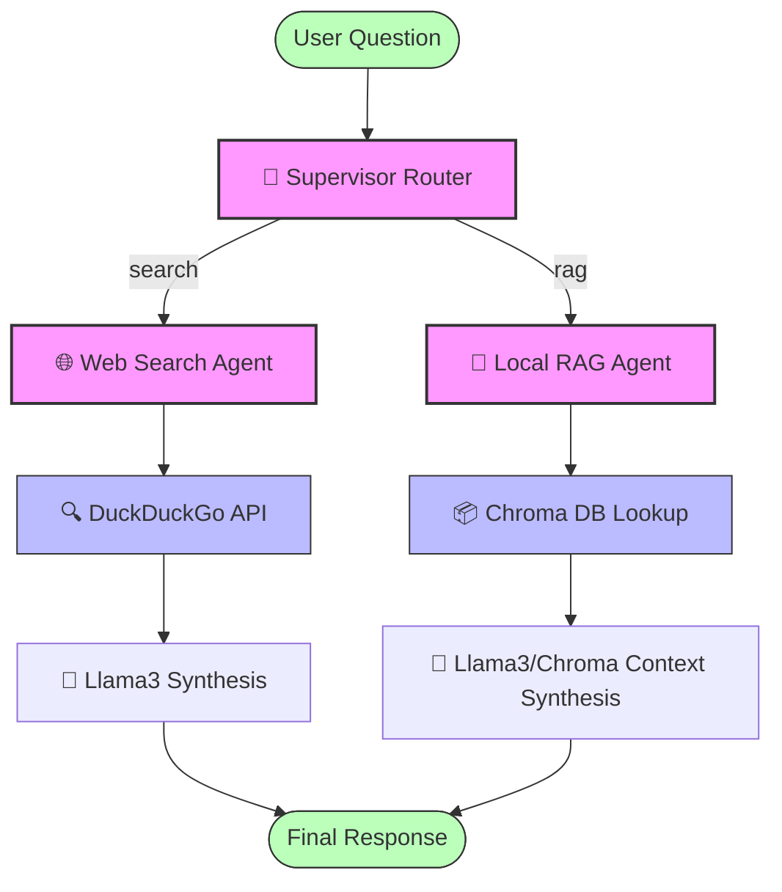

# Local Multi-Agent RAG System

An autonomous multi-agent routing system built using **LangGraph**, **LangChain**, and a local **Llama 3** model running via **Ollama**.

The system dynamically routes questions between:
1. **Live Web Search Agent**: Queries DuckDuckGo for current events/general knowledge.
2. **Local RAG Agent**: Queries a local, in-memory vector database (ChromaDB) for document-specific questions.

## 📊 System Architecture Flowchart



---

## 🛠️ Step-by-Step Setup Procedure

### 1. Install and Start Ollama
1. Download **Ollama** for macOS/Windows/Linux from [ollama.com](https://ollama.com).
2. Install and launch the application. Ensure the Ollama icon is visible in your menu bar (macOS) or system tray.
3. Open your terminal and download the **Llama 3** model:
   ```bash
   ollama pull llama3
   ```
4. Verify Ollama is running and has the model installed:
   ```bash
   ollama list
   ```

> [!TIP]
> You can also run other local models (e.g., `llama3.1`, `llama3.2`, or `mistral`) by pulling them via Ollama (`ollama pull <model-name>`) and updating the model parameter in `sanity_check.py` and `agent_system.py`.

### 2. Clone the Repository
Open your terminal and clone the repository to your local machine:
```bash
git clone https://github.com/saikrishnaallam/local_multi_agent_rag.git
cd local_multi_agent_rag
```

### 3. Configure the Python Virtual Environment
*(Recommended Python Version: 3.9, 3.10, or 3.11)*

Set up your python virtual environment and install the required dependencies:
```bash
# Create virtual environment
python3 -m venv venv

# Activate virtual environment
source venv/bin/activate

# Upgrade pip
pip install --upgrade pip

# Install dependencies
pip install -r requirements.txt
```

---

## 🚀 Running the Project

### 1. Run the Connection Sanity Check
Before launching the agent workflow, run the sanity check to confirm your local model is accessible via Ollama:

```bash
python sanity_check.py
```

**Expected Output:**
```text
🔄 Connecting to local Llama3 model via Ollama...

✅ Success! Your local AI brain is online.
🤖 AI Response: Hello! I can confirm that I am running locally via Ollama on your machine.
```

### 2. Run the Multi-Agent System
Run the main system to execute test cases for both the web search and local RAG agents:

```bash
python agent_system.py
```

> [!TIP]
> If you wish to run the agent system without Python/LangChain deprecation warnings cluttering the terminal, you can ignore them by running:
> ```bash
> python -W ignore agent_system.py
> ```

**Expected Output:**
```text
=============================================
🚀 RUNNING FULL LANGGRAPH MULTI-AGENT SYSTEM
=============================================

--- 📝 Test Case 1: Requesting Live Web Data ---
🧠 Supervisor is analyzing the request...
🎯 Router Decision: Directed to -> search
🌐 Web Search Agent is activating...
🔍 Searching the live web for: 'Who won the latest Super Bowl and what was the score?'...
🤖 Final Graph Response (Web Search):
Based on the search results, the latest Super Bowl (Super Bowl LVIII) was won by the Kansas City Chiefs, who defeated the San Francisco 49ers with a final score of 25-22 on February 11, 2024.

--- 📝 Test Case 2: Requesting Document Data ---
🧠 Supervisor is analyzing the request...
🎯 Router Decision: Directed to -> rag
📄 Local RAG Agent is activating...
🔎 Querying local vector database for: 'Based on the uploaded project document, what database engine does Project Alpha use?'...
🤖 Local model is generating a response based on document data...

🤖 Final Graph Response (Local RAG):
Based on the provided document context, Project Alpha uses PostgreSQL version 15 as its primary database engine.
```

---

## 🧠 Routing Behavior (Search vs RAG)

The **Supervisor Router** uses a prompt-based classification logic to decide where to send queries:
- **Web Search (`search`)**: Triggered for general knowledge, current events, or live web info (e.g., *"Who won the latest Super Bowl and what was the score?"*).
- **Document RAG (`rag`)**: To trigger the RAG agent, the prompt instructions require the query to explicitly refer to **uploaded files, documents, essays, or notes** (e.g., *"Based on the uploaded project overview document, what database engine does Project Alpha use?"*). 

> [!NOTE]
> If a query is generic (e.g., *"What database engine does Project Alpha use?"*), the local router will likely classify it as **search** because it is framed as general knowledge rather than a document-specific query.

### 📄 Seeded Mock Document Context
The local RAG vector database is pre-seeded with details about a mock project overview (`project_alpha_guide.pdf`). It contains the following facts:
* **Project Name**: Project Alpha
* **Primary Database**: PostgreSQL version 15
* **Session Cache**: Redis (latency under 15ms)
* **Project Lead**: Sarah Jenkins
* **Deployment Schedule**: Q4 2026

#### Additional RAG Queries to Test:
You can verify the retrieval capability by running other queries against the RAG system, such as:
* *"Based on the uploaded project overview document, who is the project lead for Project Alpha?"*
* *"Based on the uploaded guide, what is the deployment schedule for Project Alpha?"*
* *"According to the uploaded documents, what cache database is used and what is its latency?"*

---

## 🛠️ Visualizing & Debugging with LangSmith (Optional)

Since this system uses LangGraph and LangChain, you can easily trace the agent steps, supervisor routing decisions, and RAG document retrievals in a beautiful visual UI using **LangSmith**.

To enable tracing:
1. Sign up for a free account at [smith.langchain.com](https://smith.langchain.com).
2. Generate an API key from your profile settings.
3. Export the following environment variables in your terminal before running the python scripts:
   ```bash
   export LANGCHAIN_TRACING_V2="true"
   export LANGCHAIN_API_KEY="your-api-key-here"
   export LANGCHAIN_PROJECT="local-multi-agent-rag"
   ```
4. Run the scripts as normal. All executions will automatically be recorded and visualized in your LangSmith dashboard!

---

## 🔍 Troubleshooting & Common Issues

### 1. Connection Failed Error
* **Error**: `❌ Connection Failed. Error Details: ...`
* **Fix**: Ensure the Ollama app is open and running in your Mac's menu bar or system tray.

### 2. Model Not Found (404)
* **Error**: `model 'llama3' not found (status code: 404)`
* **Fix**: Run `ollama pull llama3` in your terminal to download the model weights locally.

### 3. Missing Integration / Import Errors
* **Error**: `ImportError: cannot import name 'ChatOllama' from 'langchain_community.chat_models'`
* **Fix**: Make sure you have installed `langchain-ollama` and are importing via `from langchain_ollama import ChatOllama`.
* **Error**: `ImportError: Could not import chromadb`
* **Fix**: Run `pip install chromadb` inside your active virtual environment.
* **Error**: `ImportError: Could not import duckduckgo_search`
* **Fix**: Run `pip install duckduckgo-search` inside your active virtual environment.
* **Error**: `ImportError: Could not import langgraph`
* **Fix**: Run `pip install langgraph` inside your active virtual environment.

---

## 🏗️ Architecture Under the Hood
- **StateGraph**: LangGraph manages the shared agent state (`messages` and `next_step`).
- **Supervisor Router**: Classifies the query (`search` or `rag`) using Llama 3.
- **Web Search Node**: Activates the DuckDuckGo Search tool to fetch raw internet results.
- **Local RAG Node**: Splits and embeds a mock project overview document (`project_alpha_guide.pdf`) using `OllamaEmbeddings`, indexes it into an **in-memory** Chroma instance (re-seeded on every execution), retrieves context, and answers the query.

---

## 📂 Project Structure

- [agent_system.py](agent_system.py): The main multi-agent implementation using LangGraph, including the Supervisor Router, Web Search Agent, and Local RAG Agent nodes.
- [sanity_check.py](sanity_check.py): A quick validation script to verify local connectivity to Ollama and check if the Llama 3 model is running.
- [requirements.txt](requirements.txt): Defines Python package dependencies required to run the agents.

---

## 🛠️ Customizing the System & Graph

You can easily extend this multi-agent system to add more capabilities:

### 1. Adding a New Agent/Node
To add a new agent (e.g., a "Math Agent"):
1. Define the node function in [agent_system.py](agent_system.py):
   ```python
   def math_agent(state: AgentState):
       # Define math agent logic here
       return {"messages": [AIMessage(content="Math agent response")]}
   ```
2. Register the node in the StateGraph definition:
   ```python
   workflow.add_node("math_agent", math_agent)
   ```
3. Connect the node output to `END`:
   ```python
   workflow.add_edge("math_agent", END)
   ```

### 2. Updating the Supervisor Router
Update the supervisor classification prompt inside `supervisor_router()` to define when queries should route to the new agent, and update the output map:
```python
workflow.add_conditional_edges(
    START,
    supervisor_router,
    {
        "search": "web_search",
        "rag": "local_rag",
        "math": "math_agent" # New route option
    }
)
```
