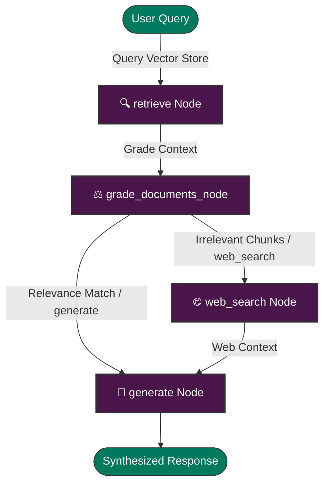

# Local Multi-Agent Corrective RAG (CRAG) System 🤖

🚀 **A 100% private, local, and autonomous multi-agent Corrective RAG (CRAG) system.** Built using **LangGraph**, **LangChain**, and **Streamlit**, powered by local models running via **Ollama**.

---

### 🌟 Project Status & Badges
[](https://www.python.org/)
[](https://streamlit.io/)
[](https://www.langchain.com/)
[](https://github.com/langchain-ai/langgraph)
[](https://ollama.com/)

---

## ✨ Key Highlights

*   **🛡️ 100% Local & Private**: No data leaves your machine. Generative reasoning (Llama 3) and text representations (`nomic-embed-text`) execute fully locally.
*   **⚖️ Self-Corrective (CRAG) Routing**: The agent does not blindly trust database search. It retrieves context, grades it using a strict Pydantic model, and automatically falls back to **DuckDuckGo Web Search** if your files don't have the answer.
*   **📄 Smarter Multi-Document Indexing**: Upload multiple PDF documents at once. The retriever extracts text chunks, prepends source document metadata tags, and feeds context from all files to the LLM in a single turn.
*   **🕵️‍♂️ Real-Time Agent Trace**: Watch the LangGraph state machine execute nodes (`retrieve` ➡️ `web_search` ➡️ `generate`) inside an expandable visual status console.
*   **💾 SQLite Session Synchronization**: Fully integrated Streamlit memory configuration guarantees that your query retriever and document indexer share the same database connections across browser reload cycles.

---

## 📊 System Architecture & Data Flow

Our agent runs on a compiled state machine, ensuring structured execution paths based on real-time grading:



---

## 🔄 Previous vs. Current Architecture

We did extensive refactoring to turn a CLI script into a fully operational local RAG workspace.

| Feature | Legacy Setup (`agent_system.py`) | Refactored Setup (`main.py` + `app.py`) | Why we changed it |
| :--- | :--- | :--- | :--- |
| **User Interface** | 💻 Terminal console executing hardcoded queries. | 🌐 **Web Chat UI** with sidebars, upload drag-and-drop slots, and node tracking expanders. | To make the local workspace accessible, user-friendly, and interactive. |
| **Vector DB Lifecycle** | 🧠 In-Memory Chroma DB (seeded fresh on startup). | 📦 **Persistent Local Chroma DB** (`./chroma_db`) with file caching. | Saves processing time by storing indexed documents locally on disk. |
| **Routing Accuracy** | 🧠 Supervisor router classified query paths before vector retrieval. | ⚖️ **Corrective RAG (CRAG)**: Retrieves data first, then uses Pydantic structured grading. | Prevents hallucinations by validating data relevance before generation. |
| **Session Memory** | ❌ None (lost when terminal process exits). | 💾 **Streamlit `st.session_state` Connection Binding**. | Prevents Streamlit's script-reload cycles from creating conflicting database descriptors. |
| **Multiple File Support** | ❌ Restricted to `k=3` chunks (crowds out extra PDFs). | ✅ **Expanded `k=10` with custom Source Metadata Tagging**. | Supports cross-document summarization by mapping chunk boundaries directly to source files. |

---

## 🧠 Under the Hood: Key Design Decisions

> [!IMPORTANT]
> **No Disk-Level Folder Deletes (`shutil.rmtree`)**
> Deleting database directories while an active process holds SQLite connections throws `readonly database` errors. We use the native Chroma SQL-level API `get()["ids"]` and `delete(ids)` to wipe files cleanly without file lock exceptions.

> [!TIP]
> **Strict Grader Tool Binding**
> Prompting local models to output simple strings often leads to unexpected parsing errors. We wrap the grader inside a Pydantic model (`RouteDecision`) and enforce structured JSON schemas via Ollama's tool binding.

---

## 🛠️ Step-by-Step Quick Start

### 1. Install and Start Ollama
1. Download **Ollama** for macOS/Windows/Linux from [ollama.com](https://ollama.com).
2. Install and launch the application.
3. Open your terminal and pull the models:
   ```bash
   # Llama 3 for reasoning, routing and synthesis
   ollama pull llama3
   
   # Nomic embeddings for document representations
   ollama pull nomic-embed-text
   ```

### 2. Configure Python Virtual Environment
*(Recommended Python Version: 3.9, 3.10, or 3.11)*

```bash
# Create virtual environment
python3 -m venv venv

# Activate virtual environment
source venv/bin/activate

# Upgrade pip
pip install --upgrade pip

# Install dependencies
pip install -r requirements.txt
```

---

## 🚀 Running the Project

### 1. Run the Web Interface (Recommended)
Launch the interactive web assistant:
```bash
streamlit run app.py
```
* Access the app in your browser at `http://localhost:8501`.
* Drag and drop multiple PDF files in the sidebar, click **Process Documents**, and start chatting.

### 2. Run CLI Ingestion (Alternative)
You can also index documents directly using the terminal utility:
```bash
python ingest.py path/to/document.pdf
```

---

## 📂 Project Structure

*   [app.py](app.py): Streamlit web application managing uploader actions, memory states, and real-time execution steps.
*   [main.py](main.py): Corrective RAG (CRAG) graph workflow connecting structured document grading and fallback search.
*   [ingest.py](ingest.py): CLI loading utility which splits and indexes PDFs into `./chroma_db`.
*   [agent_system.py](agent_system.py): Legacy supervisor-routed in-memory RAG containing mock DB seeds.
*   [sanity_check.py](sanity_check.py): Verifies local connection to Ollama and loaded model states.
*   [requirements.txt](requirements.txt): Python dependency configurations.
*   [.gitignore](.gitignore): Excludes cache directories and local document files.
