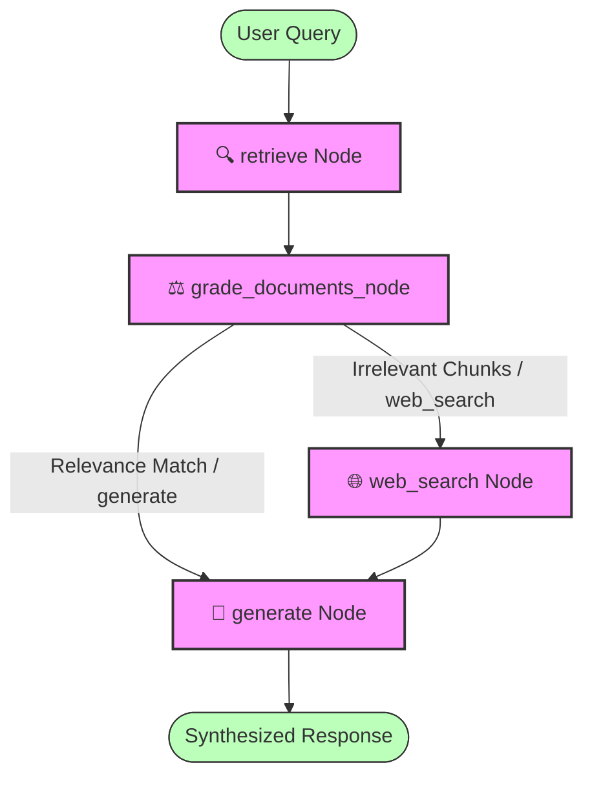

# Local Multi-Agent Corrective RAG (CRAG) System

An autonomous, local Multi-Agent Corrective RAG (CRAG) system built using **LangGraph**, **LangChain**, **Streamlit**, and a local **Llama 3** model running via **Ollama**. 

The system features hybrid search, structured document grading, web fallback search, multi-document context tagging, and a beautiful web-based chat interface.

---

## 📊 System Architecture & Data Flow

Below is the state workflow map representing our Corrective RAG execution graph:



---

## 🔄 Previous vs. Current Architecture

We transitioned the project from a simple terminal proof-of-concept into a production-ready, interactive local RAG application. Here is a summary of the differences:

| Feature | Previous Architecture (`agent_system.py`) | Current Architecture (`main.py` + `app.py`) |
| :--- | :--- | :--- |
| **User Interface** | Terminal script executing predefined test cases. | Dynamic **Streamlit Web UI** with chat bubbles, sidebar file uploaders, and collapsible workflow status trackers. |
| **Vector DB Lifecycle** | In-Memory Chroma DB (loaded and seeded fresh on every single run). | **Persistent Local Chroma DB** (`./chroma_db`) matching embedded content using `nomic-embed-text`. |
| **Routing Mechanism** | Supervisor agent classifying user queries into `search` or `rag` at start. | **Corrective RAG (CRAG)**: Retrieves documents first, then uses a strict Pydantic grader (`RouteDecision`) to route queries dynamically to `generate` or `web_search`. |
| **Ingestion Pipeline** | hardcoded mock strings seeded inside Python memory. | Independent `ingest.py` command-line indexer AND interactive uploader parser utilizing `PyPDFLoader`. |
| **Database Clearing** | N/A (cleared implicitly when the python process ended). | Safe, SQL-level deletion API execution clearing document IDs cleanly across sessions without causing SQLite write locks. |
| **Multi-File Context** | Retrieved top 3 vector chunks; no source file metadata. | Retrieves top **10** chunks and tags each with its **source filename metadata** to facilitate cross-document reasoning. |

---

## 🧠 Design Rationale: Why We Built It This Way

### 1. Persistent SQLite Database over In-Memory DB
* **Why**: An in-memory vector database requires ingestion to run every single time the app starts, which is slow and memory-intensive. Using a local persistent database (`./chroma_db`) decouples the ingestion pipeline (`ingest.py`) from query execution, making startup instantaneous.

### 2. Corrective RAG (CRAG) over Supervisor Routing
* **Why**: Supervisor routers classify the query before checking if the database contains relevant facts. If the database lacks information, the supervisor would still route to RAG, leading to hallucinations. Corrective RAG retrieves files *first* and grades them. If the graded documents are empty or irrelevant, it triggers `web_search` as an active fallback.

### 3. Pydantic Structured Route Grader
* **Why**: Prompting local LLMs to output raw strings (like "search" or "rag") is prone to formatting deviations. We use LangChain's Ollama tool binding (`llm.with_structured_output`) to force Llama 3 to output JSON conforming exactly to a Pydantic `RouteDecision` model. If structured output parsing fails, we gracefully catch the error and route to `web_search` to guarantee runtime safety.

### 4. Streamlit Session State Database Coordination
* **Why**: Streamlit re-runs the entire python script on user input and reloads module imports. If the database object reference was stored inside a Python module, Streamlit's classloader could instantiate multiple cached module copies, leading to out-of-sync database states. Storing the active connection inside `st.session_state.vector_db` and dynamically retrieving it inside the graph guarantees that both the uploader and retriever share the same active SQLite descriptor.

### 5. SQL-Level Deletion vs. Disk Deletion (`shutil.rmtree`)
* **Why**: Deleting the database folder from disk while the Python process is running causes SQLite to throw `attempt to write a readonly database` due to locked file handles. By keeping the SQLite connection open and calling `vector_db.delete(ids)`, we clear all files at the database layer cleanly and safely.

### 6. Expanded Retrieval Constraint (`k=10`) and Source Tagging
* **Why**: Setting `k=3` causes search bias where chunks from one PDF crowd out chunks from another, preventing summaries across multiple files. Increasing `k` to `10` allows context from multiple PDFs to load simultaneously. Prepending `[Source File: filename]` helps the LLM distinguish contexts to produce comprehensive multi-file answers.

---

## 🛠️ Step-by-Step Setup Procedure

### 1. Install and Start Ollama
1. Download **Ollama** for macOS/Windows/Linux from [ollama.com](https://ollama.com).
2. Install and launch the application.
3. Open your terminal and pull the required models:
   ```bash
   # Pull the Llama 3 model for reasoning/generation and grading
   ollama pull llama3
   
   # Pull the nomic embedding model for text representation
   ollama pull nomic-embed-text
   ```
4. Verify Ollama is running and has the models installed:
   ```bash
   ollama list
   ```

### 2. Configure the Python Virtual Environment
*(Recommended Python Version: 3.9, 3.10, or 3.11)*

```bash
# Create virtual environment
python3 -m venv venv

# Activate virtual environment
source venv/bin/activate

# Upgrade pip
pip install --upgrade pip

# Install dependencies
pip install -r requirements.txt
```

---

## 🚀 Running the Project

### 1. Run Ingestion via CLI (Optional)
You can ingest arbitrary PDF documents to the persistent database directly from your command line:
```bash
python ingest.py path/to/your/document.pdf
```

### 2. Run the Streamlit Interface (Recommended)
Launch the interactive web assistant:
```bash
streamlit run app.py
```
* The interface will open at `http://localhost:8501`.
* **Sidebar**: Drop one or more PDFs, click **Process Documents**, and wait for the success notification. (Old document contents will be wiped automatically).
* **Chat Window**: Type queries like *"Summarize the uploaded documents"* or ask specific fact questions.
* **Workflow Status**: Expand **Agent Workflow 🕵️‍♂️** in the chat responses to watch LangGraph execute nodes (`retrieve` -> `web_search` -> `generate`) in real time!

### 3. Run the Legacy Terminal Multi-Agent System
Run the legacy supervisor workflow (using the in-memory mock Chroma setup) through the terminal:
```bash
python agent_system.py
```

---

## 📂 Project Structure

* [app.py](app.py): Streamlit web application orchestrating chat history, sidebar PDF uploaders, dynamic database resets, and real-time execution trace rendering.
* [main.py](main.py): Corrective RAG (CRAG) LangGraph backend containing the structured grader, retrieval formatting, and workflow compilation.
* [ingest.py](ingest.py): CLI ingestion script to split and store text pages in `./chroma_db` using `nomic-embed-text`.
* [agent_system.py](agent_system.py): Legacy in-memory Hybrid Search agent containing `CrossEncoder` reranking logic.
* [sanity_check.py](sanity_check.py): Quick connectivity utility validating Ollama communication.
* [requirements.txt](requirements.txt): List of dependencies required to run the project.
* [.gitignore](.gitignore): Ignores local database folders (`chroma_db/`) and test PDFs.
